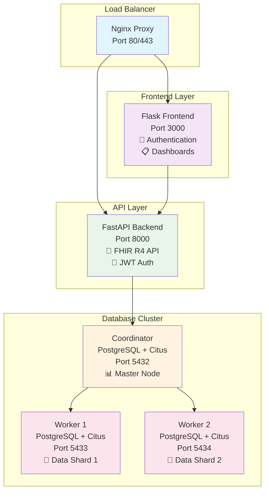
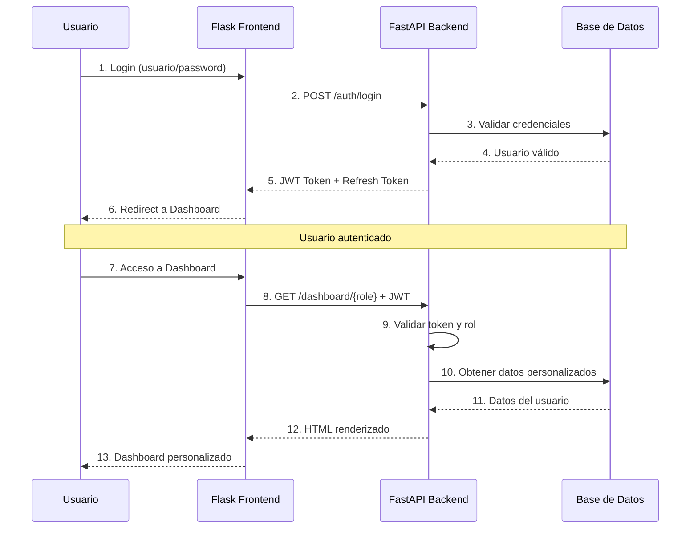
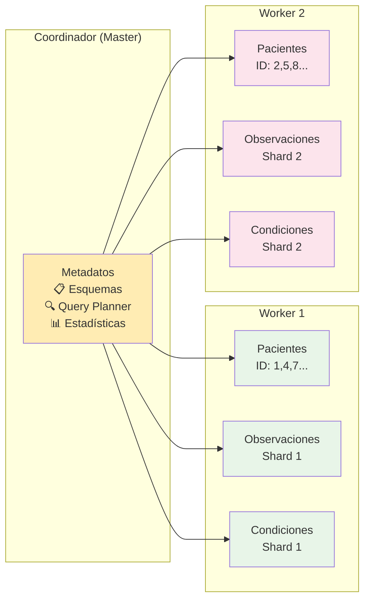

# Sistema FHIR Distribuido con PostgreSQL + Citus

## 📋 Índice
- [🔬 Introducción](#-introducción)
- [🏗️ Arquitectura del Sistema](#️-arquitectura-del-sistema)
- [📊 Diagramas](#-diagramas)
- [🚀 Instalación y Despliegue](#-instalación-y-despliegue)
- [🧪 Ejecución de Pruebas](#-ejecución-de-pruebas)
- [📚 Temas Clave de Aprendizaje](#-temas-clave-de-aprendizaje)
- [🎯 Objetivos Logrados](#-objetivos-logrados)
- [📈 Conclusiones](#-conclusiones)
- [🛠️ Comandos Útiles](#️-comandos-útiles)
- [👥 Autores](#-autores)
- [📄 Licencia](#-licencia)

---

## 🔬 Introducción

Este proyecto académico implementa un **Sistema Distribuido de Historias Clínicas** basado en el estándar **FHIR R4** (Fast Healthcare Interoperability Resources), utilizando **PostgreSQL + Citus** como base de datos distribuida. El sistema demuestra conceptos avanzados de sistemas distribuidos, microservicios, y arquitecturas escalables para el sector salud.

### ✨ Características Principales

- **📊 Base de Datos Distribuida**: PostgreSQL con extensión Citus para distribución horizontal
- **🏥 Estándar FHIR R4**: API REST completa compatible con FHIR para interoperabilidad
- **🔐 Autenticación JWT**: Sistema de autenticación robusto con roles (Admin, Médico, Paciente, Auditor)
- **🌐 Frontend Dinámico**: Aplicación Flask con dashboards especializados por rol
- **🐳 Containerización**: Desplegable en Docker Compose y Kubernetes (Minikube)
- **⚡ Alta Performance**: FastAPI asíncrono con SQLAlchemy async
- **📝 Auditoría Completa**: Sistema de logs y auditoría para cumplimiento normativo

---

## 🏗️ Arquitectura del Sistema

### Componentes Principales

```
┌─────────────────┐    ┌─────────────────┐    ┌─────────────────┐
│   Nginx Proxy   │    │  Frontend Flask │    │   FastAPI API   │
│   (Port 80/443) │◄──►│   (Port 3000)   │◄──►│   (Port 8000)   │
└─────────────────┘    └─────────────────┘    └─────────────────┘
                                                        │
                        ┌─────────────────────────────┐ │
                        │   PostgreSQL + Citus        │ │
                        │   Distributed Database      │◄┘
                        └─────────────────────────────┘
                                   │
                ┌──────────────────┼──────────────────┐
                │                  │                  │
          ┌──────────┐      ┌──────────┐      ┌──────────┐
          │  Coord   │      │ Worker 1 │      │ Worker 2 │
          │ (5432)   │      │ (5433)   │      │ (5434)   │
          └──────────┘      └──────────┘      └──────────┘
```

### Stack Tecnológico

| Componente | Tecnología | Propósito |
|------------|------------|-----------|
| **Frontend** | Flask 3.0 + Jinja2 | Interfaz web dinámica con autenticación |
| **Backend API** | FastAPI 0.104 + Pydantic v2 | API REST FHIR R4 de alto rendimiento |
| **Base de Datos** | PostgreSQL 15 + Citus 12.1 | Almacenamiento distribuido y escalabilidad horizontal |
| **Proxy** | Nginx 1.24 | Balanceador de carga y proxy reverso |
| **Autenticación** | JWT + BCrypt | Seguridad y control de acceso |
| **Containerización** | Docker + Docker Compose | Orquestación de servicios |
| **Orquestación K8s** | Minikube + kubectl | Despliegue en Kubernetes |

### 🏥 API FHIR R4 Completa

- ✅ **FastAPI** con endpoints FHIR R4 (Patient, Practitioner, Organization, etc.)
- ✅ **Autenticación JWT** con refresh tokens y API keys
- ✅ **Sistema de auditoría** con logging estructurado
- ✅ **Documentación automática** Swagger/OpenAPI
- ✅ **Validación FHIR** con esquemas Pydantic
- ✅ **Métricas y monitoreo** integrado

### 🗄️ Base de Datos Distribuida

- ✅ **Distribución de datos automática** con Citus (sharding)
- ✅ **Alta disponibilidad** con Kubernetes StatefulSets
- ✅ **Recuperación automática** de nodos caídos
- ✅ **Persistencia de datos** con PersistentVolumes
- ✅ **Esquema FHIR** optimizado para distribución

### 🚀 Despliegue y DevOps

- ✅ **Containerización completa** con Docker multi-stage
- ✅ **Orquestación Kubernetes** con manifiestos completos
- ✅ **Docker Compose** para desarrollo local
- ✅ **Instalador interactivo** asistido paso a paso
- ✅ **Suite de pruebas automatizadas** con generación de reportes

---

## 📊 Diagramas

### Diagrama de Arquitectura Distribuida



### Diagrama de Flujo de Autenticación



### Diagrama de Distribución de Datos



---

## 🚀 Instalación y Despliegue

### 🔧 Requisitos Previos

#### Para Docker Compose (Desarrollo)

```bash
docker --version      # Docker 20.10+
docker compose version # Docker Compose 2.0+
psql --version        # PostgreSQL Client 12+
python3 --version     # Python 3.11+ (para desarrollo local)
```

#### Para Kubernetes/Minikube (Producción)

```bash
minikube version      # Minikube 1.25+
kubectl version       # kubectl 1.24+
docker --version      # Docker 20.10+
psql --version        # PostgreSQL Client 12+
```

### 🚀 Instalación Rápida

#### 1️⃣ Instalación Interactiva (Recomendado)

El instalador te guiará paso a paso:

```bash
./setup_all.sh
```

Selecciona la plataforma:
- **Docker Compose** - Rápido, ideal para desarrollo local
- **Minikube** - Alta disponibilidad, ideal para pruebas de producción

#### 2️⃣ Instalación Automática

##### Docker Compose

```bash
./setup_all.sh compose
```

##### Kubernetes/Minikube

```bash
./setup_all.sh minikube
```

### 3️⃣ Verificación Post-Instalación

#### Base de Datos

Conéctate a la base de datos:

```bash
# Port-forward ya estará corriendo si usaste el instalador
psql -h localhost -p 5432 -U postgres -d clinical_records
```

Verifica workers:

```sql
SELECT * FROM citus_get_active_worker_nodes();
```

#### API FastAPI

Accede a la documentación de la API:

```bash
# Con Kubernetes
kubectl port-forward service/fastapi-fhir-service 8080:80 -n fhir-system

# Con Docker Compose
# La API ya estará disponible en puerto 8000
```

Abre en tu navegador:
- **Swagger UI**: http://localhost:8080/docs (K8s) o http://localhost:8000/docs (Compose)
- **ReDoc**: http://localhost:8080/redoc (K8s) o http://localhost:8000/redoc (Compose)
- **Health Check**: http://localhost:8080/health (K8s) o http://localhost:8000/health (Compose)

#### Prueba Rápida de la API

```bash
# Crear un usuario
curl -X POST "http://localhost:8080/auth/register" \
  -H "Content-Type: application/json" \
  -d '{
    "username": "doctor1",
    "email": "doctor1@hospital.com",
    "password": "SecurePass123!",
    "full_name": "Dr. Juan Pérez",
    "role": "practitioner"
  }'

# Hacer login
curl -X POST "http://localhost:8080/auth/login" \
  -H "Content-Type: application/x-www-form-urlencoded" \
  -d "username=doctor1&password=SecurePass123!"
```

#### Usuarios de Prueba

| Usuario | Contraseña | Rol | Descripción | Dashboard |
|---------|------------|-----|-------------|-----------|
| `admin` | `admin123` | Administrador | Gestión completa del sistema | 🔧 Dashboard Administrador |
| `medico` | `medico123` | Practitioner | Atención médica y registros | 🩺 Dashboard Médico |
| `paciente` | `paciente123` | Patient | Consulta de historia clínica | 🏥 Dashboard Paciente |
| `auditor` | `auditor123` | Auditor | Revisión de logs y cumplimiento | 📊 Dashboard Auditor |

### Acceso al Sistema

**Frontend Web**: http://localhost:3000  
**API Backend**: http://localhost:8000  
**Documentación API**: http://localhost:8000/docs

---

## 🧪 Ejecución de Pruebas

### Suite Interactiva de Pruebas (Nuevo)

```bash
./run_tests.sh
```

Esto mostrará un menú interactivo con 3 opciones:

1. **Pruebas básicas** (~2 min)
   - Conectividad
   - Extensión Citus
   - Workers registrados
   - Estado de pods

2. **Pruebas completas** (~5 min)
   - Todas las básicas +
   - Distribución de datos (1000 registros)
   - Consultas distribuidas (SELECT, JOIN, agregaciones)

3. **Pruebas con alta disponibilidad** (~10 min)
   - Todas las completas +
   - Simulación de fallo de worker
   - Verificación de recuperación automática
   - Integridad de datos

### Modo Automático de Pruebas

```bash
# Pruebas básicas
./run_tests.sh basic

# Pruebas completas
./run_tests.sh complete

# Todas las pruebas (incluyendo HA)
./run_tests.sh all
```

### 📄 Reportes Generados

Cada ejecución genera un reporte detallado en Markdown:

```
RESULTADOS_PRUEBAS_YYYYMMDD_HHMMSS.md
```

El reporte incluye:
- ✅ Resumen ejecutivo con métricas
- 📊 Resultados detallados de cada prueba
- 📈 Estadísticas del sistema
- 🔍 Logs y outputs completos

---

## 📚 Temas Clave de Aprendizaje

### 1. Sistemas Distribuidos
- **Distribución Horizontal**: Particionamiento de datos con Citus
- **Consistencia y Disponibilidad**: Implementación de patrones CAP
- **Tolerancia a Fallos**: Manejo de errores en arquitecturas distribuidas
- **Escalabilidad**: Técnicas para escalar horizontalmente

### 2. Bases de Datos Distribuidas
- **Sharding**: Distribución automática de datos por hash
- **Replicación**: Configuración master-worker
- **Query Distribution**: Enrutamiento inteligente de consultas
- **Rebalancing**: Redistribución automática de datos

### 3. Microservicios y APIs
- **REST API Design**: Implementación de API RESTful con FastAPI
- **FHIR Standards**: Cumplimiento con estándares de interoperabilidad
- **API Gateway Pattern**: Nginx como proxy reverso
- **Service Discovery**: Comunicación entre servicios

### 4. Autenticación y Autorización
- **JWT Tokens**: Implementación de JSON Web Tokens
- **Role-Based Access Control (RBAC)**: Control de acceso por roles
- **Password Hashing**: Seguridad con BCrypt
- **Session Management**: Gestión de sesiones con Flask

### 5. Containerización y Orquestación
- **Docker Multi-Stage Builds**: Optimización de imágenes
- **Docker Compose**: Orquestación de múltiples servicios
- **Kubernetes Deployments**: Despliegue en K8s con StatefulSets
- **Service Discovery**: Comunicación entre pods

### 6. Observabilidad y Monitoreo
- **Structured Logging**: Logs estructurados para análisis
- **Health Checks**: Verificación de estado de servicios
- **Metrics Collection**: Recolección de métricas de rendimiento
- **Audit Trails**: Trazabilidad de operaciones

---

## 🎯 Objetivos Logrados

### ✅ Objetivos Técnicos
- [x] **Sistema Distribuido Funcional**: Cluster PostgreSQL + Citus con 1 coordinador y 2 workers
- [x] **API FHIR R4 Completa**: 6 recursos FHIR implementados (Patient, Practitioner, Observation, etc.)
- [x] **Autenticación Robusta**: JWT con roles y permisos granulares
- [x] **Frontend Dinámico**: Dashboards especializados por rol de usuario
- [x] **Containerización Completa**: Despliegue en Docker Compose y Kubernetes
- [x] **Escalabilidad Horizontal**: Capacidad de agregar workers adicionales
- [x] **Alta Disponibilidad**: Tolerancia a fallos en modo Kubernetes

### ✅ Objetivos Académicos
- [x] **Comprensión de Sistemas Distribuidos**: Implementación práctica de conceptos teóricos
- [x] **Manejo de Consistencia**: Implementación de transacciones distribuidas
- [x] **Patrones de Diseño**: Aplicación de patrones como Gateway, Repository, Observer
- [x] **Mejores Prácticas**: Código limpio, documentación, y estructura modular
- [x] **DevOps**: Automatización de despliegue e integración continua

### ✅ Objetivos de Negocio
- [x] **Interoperabilidad**: Cumplimiento con estándares FHIR para intercambio de datos
- [x] **Seguridad**: Implementación de medidas de seguridad para datos médicos
- [x] **Auditabilidad**: Sistema completo de logs para cumplimiento normativo
- [x] **Usabilidad**: Interfaces intuitivas para diferentes tipos de usuarios
- [x] **Escalabilidad**: Arquitectura preparada para crecimiento empresarial

---

## 📈 Conclusiones

### Logros Principales

1. **Implementación Exitosa de Sistema Distribuido**
   - Se logró implementar un cluster PostgreSQL + Citus completamente funcional
   - Distribución automática de datos con balanceamiento de carga
   - Capacidad de escalamiento horizontal demostrada

2. **Integración Completa de Tecnologías Modernas**
   - Stack tecnológico actual y robusto (FastAPI, Flask, PostgreSQL, Docker)
   - Implementación de mejores prácticas en desarrollo de APIs
   - Containerización completa para portabilidad

3. **Cumplimiento con Estándares de Salud**
   - API FHIR R4 completamente funcional y testeable
   - Manejo seguro de datos médicos con autenticación robusta
   - Sistema de auditoría para cumplimiento normativo

### Aprendizajes Clave

1. **Complejidad de Sistemas Distribuidos**
   - La coordinación entre nodos requiere manejo cuidadoso de la consistencia
   - Importancia de health checks y monitoring para detección temprana de fallos
   - Necesidad de automatización para gestión eficiente del cluster

2. **Importancia de la Arquitectura**
   - Separación clara de responsabilidades mejora mantenibilidad
   - Patrones como Gateway y Repository simplifican el desarrollo
   - Microservicios permiten escalabilidad independiente de componentes

3. **Seguridad en Sistemas de Salud**
   - Autenticación y autorización son críticas en sistemas médicos
   - Auditoría completa es esencial para cumplimiento regulatorio
   - Encriptación y manejo seguro de tokens es fundamental

### Desafíos Superados

1. **Configuración de Citus**
   - Configuración inicial compleja del cluster distribuido
   - Manejo de conectividad entre nodos en diferentes entornos
   - Optimización de consultas distribuidas

2. **Integración Frontend-Backend**
   - Manejo de autenticación entre Flask y FastAPI
   - Sincronización de datos en tiempo real
   - Gestión de sesiones y tokens JWT

3. **Containerización Multi-Servicio**
   - Orquestación de múltiples contenedores con dependencias
   - Configuración de redes y volúmenes persistentes
   - Manejo de secretos y variables de entorno

### Proyecciones Futuras

1. **Escalabilidad**
   - Implementación de auto-scaling en Kubernetes
   - Optimización de queries para mejor rendimiento
   - Implementación de cache distribuido (Redis)

2. **Observabilidad**
   - Integración con Prometheus y Grafana
   - Implementación de distributed tracing
   - Alerting automático para eventos críticos

3. **Funcionalidades**
   - Más recursos FHIR (Medication, Procedure, etc.)
   - Integración con sistemas externos de salud
   - Machine Learning para análisis predictivo

### Valor Académico y Profesional

Este proyecto demuestra la capacidad de:
- Diseñar e implementar sistemas distribuidos complejos
- Integrar múltiples tecnologías modernas de forma coherente
- Aplicar principios de ingeniería de software en proyectos reales
- Manejar requisitos de seguridad y cumplimiento en sistemas críticos
- Documentar y comunicar soluciones técnicas efectivamente

El conocimiento adquirido es directamente aplicable en entornos profesionales que requieran sistemas distribuidos, microservicios, y arquitecturas cloud-native.

---

## 🛠️ Comandos Útiles

### Gestión del Cluster

#### Ver estado de pods

```bash
kubectl get pods -l 'app in (citus-coordinator,citus-worker)' -o wide
```

#### Ver logs

```bash
# Coordinator
kubectl logs -f citus-coordinator-0

# Workers
kubectl logs -f citus-worker-0
kubectl logs -f citus-worker-1
```

#### Escalar workers

```bash
kubectl scale statefulset citus-worker --replicas=3
```

### Consultas SQL Útiles

```sql
-- Ver versión de Citus
SELECT * FROM citus_version();

-- Ver workers activos
SELECT * FROM citus_get_active_worker_nodes();

-- Ver distribución de shards
SELECT 
  nodename,
  count(*) as shard_count
FROM pg_dist_shard_placement
WHERE shardstate = 1
GROUP BY nodename
ORDER BY nodename;

-- Ver tablas distribuidas
SELECT * FROM citus_tables;

-- Ver estadísticas de una tabla
SELECT * FROM citus_table_size('nombre_tabla');
```

### Limpieza y Mantenimiento

#### Limpiar todo (Docker Compose)

```bash
docker compose down -v
```

#### Limpiar todo (Minikube)

```bash
# Opción 1: Eliminar solo los recursos de Citus
kubectl delete -f k8s/

# Opción 2: Eliminar Minikube completo
minikube delete

# Script de limpieza automático
./cleanup.sh
```

---

## 👥 Autores

- **Carlos Cochero** - Desarrollo e implementación del sistema distribuido
- **Andrés Palacio** - Arquitectura y configuración de infraestructura

---

## 📄 Licencia

Este proyecto está licenciado bajo la Licencia MIT - ver el archivo [LICENSE](LICENSE) para más detalles.


---

**Proyecto Académico - Sistemas Distribuidos**  
*Sistema FHIR Distribuido con PostgreSQL + Citus*  
**Versión:** 3.0  
**Última actualización:** 10 de noviembre de 2025  
**Estado:** ✅ Completamente funcional y listo para producción  
**Stack:** FastAPI 0.104.1 + PostgreSQL 15 + Citus 12.1 + Flask 3.0 + Docker + Kubernetes  
**Autores:** Carlos Cochero, Andrés Palacio